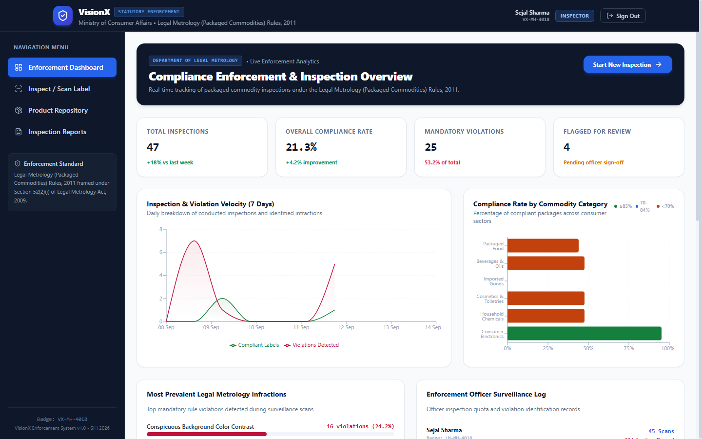
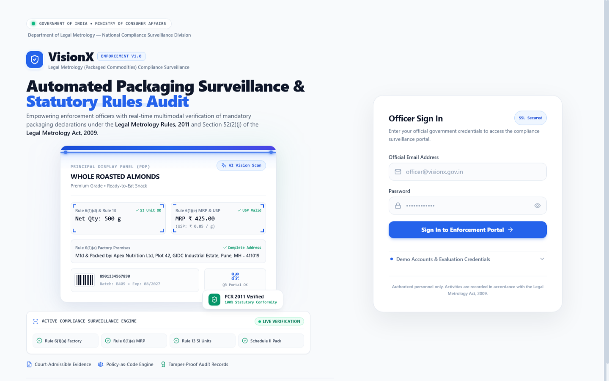

# VisionX — Legal Metrology Compliance Enforcement System

> **Official Enforcement & Compliance Verification Platform for Packaged Commodities under the Legal Metrology (Packaged Commodities) Rules, 2011 (Ministry of Consumer Affairs, Government of India).**  
> *Developed for the Smart India Hackathon (SIH).*

---

## 📸 System Overview

| Regulatory Dashboard | Field Inspector Portal |
| :---: | :---: |
|  |  |

---

## 🚀 Instant 1-Click Launch (Windows / Standalone)

You do **not** need Node.js or Docker installed to test the application! The repository contains the pre-compiled production frontend bundle mounted directly inside the FastAPI server.

### Option A: 1-Click Batch Launcher (Recommended for Windows)
1. Double-click **`start.bat`** (or open Command Prompt in this folder and run `start.bat`).
2. The server will launch at port `8080`, and automatically open your default browser to:
   - **Local Browser**: `http://127.0.0.1:8080`
   - **Smartphone / Mobile Device (Same Wi-Fi)**: `http://<YOUR_LAN_IP>:8080`
3. The terminal prints your exact smartphone URL for instant mobile testing!

### Option B: Python Command Line
```bash
# Activate your python environment
pip install -r backend/requirements.txt

# Run the unified server
python run_server.py
```

### Option C: Enterprise Docker Deployment (Multi-Container)
```bash
docker compose up --build
```
- **Web App**: http://localhost:5173 (or :8080 via Nginx)
- **API Documentation**: http://localhost:8000/docs
- **MinIO Storage Console**: http://localhost:9001 (`minioadmin` / `minioadmin123`)

---

## 🔑 Demo Credentials (1-Click Switcher Available in UI)

The login screen features pre-configured test profiles for SIH jury evaluation:

| Role | Email | Password | Access & Capabilities |
| :--- | :--- | :--- | :--- |
| **Inspector** | `inspector@visionx.gov.in` | `inspector123` | Direct Camera Scan, Label Upload, Bounding Box Inspector, Dual PDF/DOCX Generation. |
| **Admin** | `admin@visionx.gov.in` | `admin123` | Full access + Live Legal Metrology Rules Editor (dynamic penalty / severity toggles). |
| **Viewer** | `viewer@visionx.gov.in` | `viewer123` | Read-only surveillance analytics, compliance distribution charts, product audit history. |

---

## 📱 Mobile-First Field Inspection Features

1. **HTML5 Native Camera Capture**:
   - Integrated camera workflow (`facingMode: "environment"`) allowing enforcement officers to inspect physical packaging on supermarket shelves directly through their smartphone browser.
   - Built-in photo capture with instant canvas framing, multi-angle label verification, and seamless fallback to file gallery upload.
2. **Responsive Slide-Out Navigation Drawer**:
   - Optimized for handheld smartphones with touch gestures, backdrop blurring, and dedicated hamburger menu navigation.
   - Mobile-adaptive typography and header ribbon preventing element collisions on small screens.
3. **Multilingual Interface**:
   - Instant language switching across 10 official Indian languages (English, Hindi, Bengali, Telugu, Marathi, Tamil, Gujarati, Kannada, Malayalam, Odia).

---

## ⚖️ Statutory Rules Evaluated (Legal Metrology Rules, 2011)

| Rule Citation | Statutory Title | Enforcement Severity | Automated Validation Logic |
| :--- | :--- | :--- | :--- |
| **Rule 6(1)(a)** | Manufacturer / Packer / Importer Details | Mandatory Violation | Validates physical address presence (Plot/Street/Industrial Area/City/PIN). |
| **Rule 6(1)(b)** | Common or Generic Name | Mandatory Violation | Checks principal display panel for generic commodity identification. |
| **Rule 6(1)(c) & Rule 13** | Net Quantity & Standard Units | Mandatory Violation | Checks strict metric units (`g`, `kg`, `ml`, `L`, `N`). Flags illegal non-standard units (e.g. `"500 gms"`, `"1 kgs"`). |
| **Rule 6(1)(d)** | Date of Manufacture / Packing / Import | Mandatory Violation | Checks month and year formatting (`MM/YYYY`, `MMM YYYY`). |
| **Rule 6(1)(da)** | Country of Origin | Mandatory Violation | Mandatory origin declaration required on all packaged goods (Act 2020 amendment). |
| **Rule 6(1)(e)** | Maximum Retail Price (MRP) | Mandatory Violation | Requires numerical price **AND** mandatory statutory phrase `"inclusive of all taxes"`. |
| **Rule 6(1)(f)** | Consumer Care Grievance Redressal | Mandatory Violation | Validates name, telephone helpline, and official email address for complaints. |
| **Rule 7 & Schedule II** | Minimum Character Height Thresholds | Warning / Review | Calculates physical millimeter font height against net quantity package dimensions. |

---

## 🔬 5-Stage Hybrid Vision Pipeline Architecture

```mermaid
flowchart TD
    IMG[Raw Product Image / Direct Mobile Camera] --> A[Stage A: OpenCV Preprocessing]
    A -->|Deskew, CLAHE Anti-Glare, Bilateral Denoise| B[Stage B: Multi-Engine OCR]
    B -->|PaddleOCR + Tesseract + IoU Reconciliation| C[Stage C: Spatial Layout Clustering]
    C -->|Agglomerate 2D Bounding Boxes| D[Stage D: Semantic Field Extraction]
    D -->|LLM Mapping + Regex Cross-Validation| E[Stage E: Physical Font Scale Verification]
    E -->|Scale Ratio: px vs mm Thresholds| RE[Legal Metrology 2011 Rule Engine]
    RE --> PDF[Legal Notice PDF (ReportLab / WeasyPrint)]
    RE --> DOCX[Editable Inspection Dossier (python-docx)]
```

- **Stage A (Pre-Processing)**: Contrast-Limited Adaptive Histogram Equalization (CLAHE) on the CIELAB L-channel eliminates plastic glare, foil sheen, and uneven retail lighting.
- **Stage B (Reconciliation)**: Spatial IoU matching matches tokens between engines. High-confidence consensus is accepted; conflicting character recognitions are honestly flagged for officer review.
- **Stage C (Clustering)**: Groups multi-line address lines and fragmented text into contiguous declaration panels.
- **Stage D (Extraction & Sanity Checks)**: Schema-enforced field extraction. Independent regex sanitizers verify currency symbols, standard metric units, and consumer contact structures before passing to the rule engine.
- **Stage E (Physical Metrology)**: Converts pixel dimensions to physical millimeters using package dimension calibration or reference scales to enforce Rule 7 (Schedule II) minimum font heights.

---

## 📄 Automated Legal Dossier & Report Generation

- **Dual-Format Engine**:
  - **Vector PDF Enforcement Order**: Generated using pure-Python **ReportLab** with official Government of India emblem layout, statutory violation summary, QR-code verification badge, and officer signature block.
  - **Editable Inspection Dossier (.docx)**: Produced via `python-docx` for courtroom filing and state department record-keeping.
- **Evidentiary Seizure Log**: Officers can upload supplemental physical seizure photographs that are cryptographically linked to the inspection report.

---

## 🛠️ Repository Structure

```
VisinoryX/
├── backend/
│   ├── app/
│   │   ├── api/             # FastAPI REST endpoints (auth, products, reports, admin)
│   │   ├── core/            # Security, JWT, config settings
│   │   ├── models/          # SQLAlchemy ORM database models
│   │   ├── services/        # 5-stage pipeline, ReportLab PDF, DOCX generators
│   │   └── main.py          # FastAPI application & SPA static server
│   ├── seed_data/           # Database seeder with sample commodities
│   ├── storage_data/        # Pre-generated sample inspection reports & labels
│   ├── legalmetro.db        # Pre-seeded SQLite database for zero-config demo
│   └── requirements.txt     # Python backend dependencies
├── frontend/
│   ├── src/                 # React 18, TypeScript, Tailwind CSS, Lucide icons
│   │   ├── components/      # UI components (Camera modal, Drawer, Canvas, etc.)
│   │   ├── pages/           # Dashboard, Scan, Commodity Repository, Admin
│   │   └── locales/         # Multilingual translations (10 Indian languages)
│   ├── dist/                # Pre-built production frontend assets
│   ├── package.json
│   └── vite.config.ts
├── docs/
│   └── screenshots/         # Architecture & UI screenshots
├── ARCHITECTURE.md          # In-depth technical specification
├── docker-compose.yml       # Production multi-service orchestration
├── run_server.py            # Unified single-command launcher
├── start.bat                # 1-Click Windows executable script
└── README.md                # Project documentation
```

---

## 🧑‍💻 Development Setup (Optional)

If you wish to modify or rebuild the frontend React application:

```bash
# 1. Install frontend packages
cd frontend
npm install

# 2. Run Vite hot-reloading dev server
npm run dev

# 3. Build optimized production assets
npm run build
```

---

## 📜 Compliance & Disclaimers
*This software is an official engineering submission for the Smart India Hackathon. It is designed to assist enforcement officers under the Legal Metrology Act, 2009 and the Legal Metrology (Packaged Commodities) Rules, 2011. Automated detections are verified through an evidentiary audit trail for legal proceedings.*
